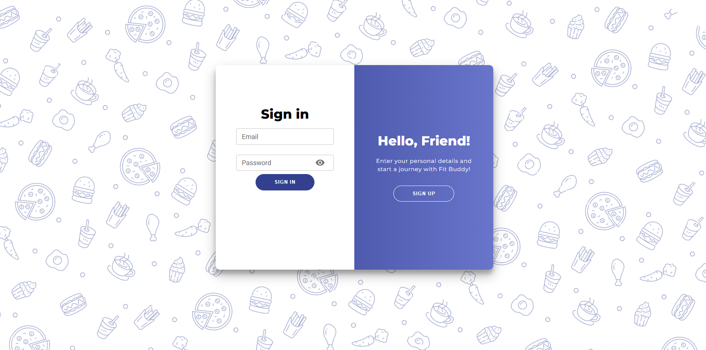
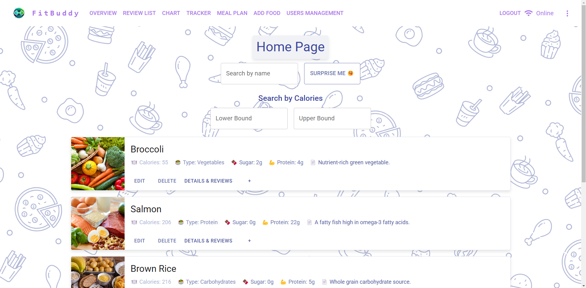
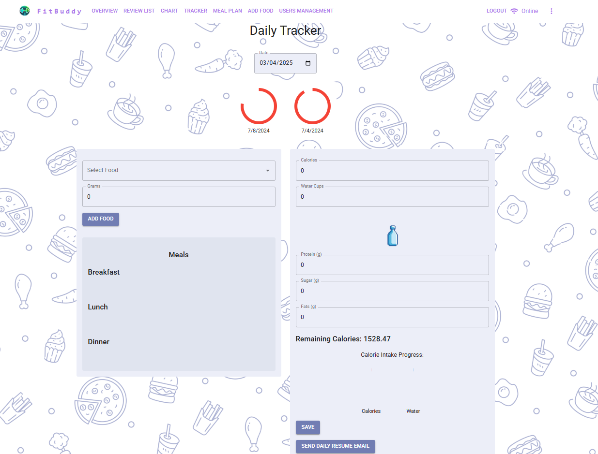
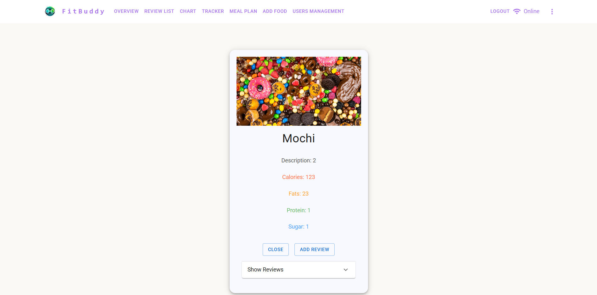
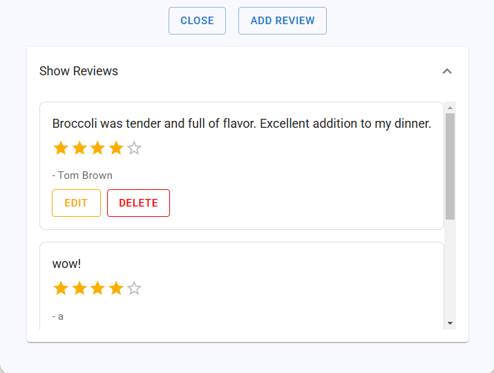
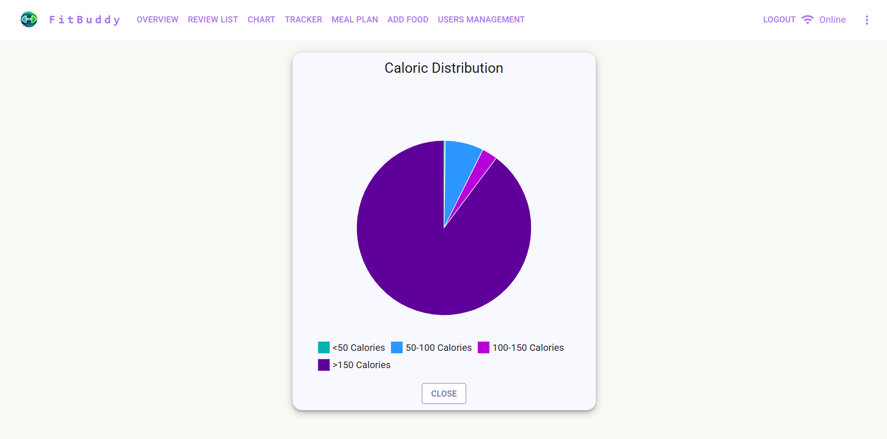
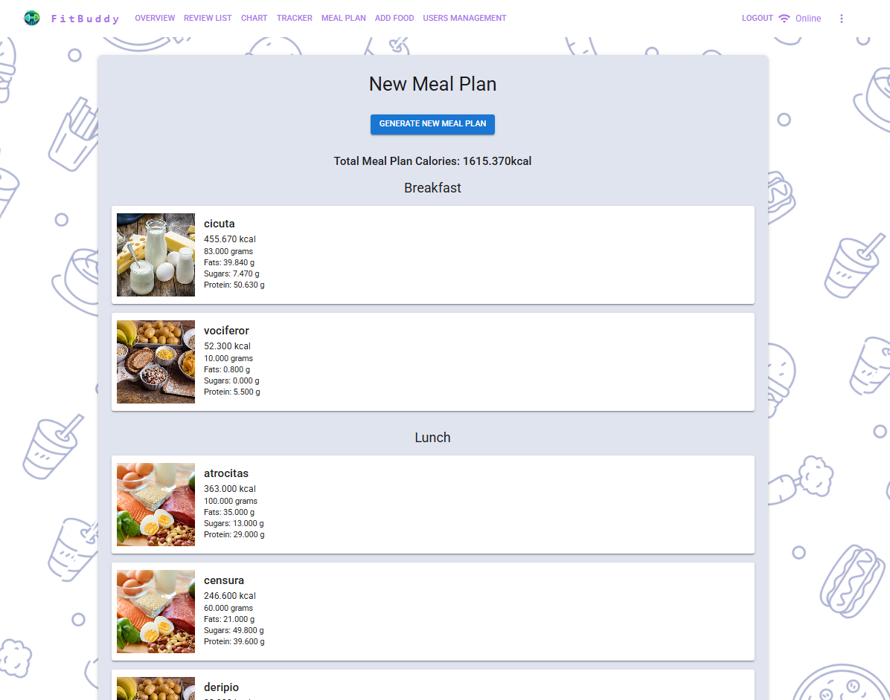
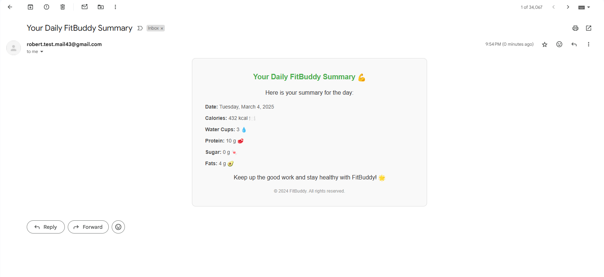

<!-- PROJECT LOGO -->
 

  

  <h3 align="center">FitBuddy</h3>

  

    A React-based frontend application for tracking daily food intake, generating meal plans, searching foods by calorie range, reading & writing reviews, and more.
     
    <a href="https://github.com/manearobert3/MPP_frontend"><strong>Explore the project »</strong></a>
     
   
  

<!-- TABLE OF CONTENTS -->

  
Table of Contents

  <ol>
    <li>
      <a href="#about-the-project">About The Project</a>
      <ul>
        <li><a href="#built-with">Built With</a></li>
      </ul>
    </li>
    <li><a href="#features">Usage & Main Features</a></li>
    <li><a href="#license">License</a></li>
    <li><a href="#contact">Contact</a></li>
    <li><a href="#acknowledgments">Acknowledgments</a></li>
  </ol>

<!-- ABOUT THE PROJECT -->

## About The Project

FitBuddy is a simple React-based web application that allows users to:

-   Track daily food intake and water consumption
-   Generate and customize meal plans
-   Search for foods by calorie ranges
-   View and add reviews for different foods
-   Visualize calorie distribution via charts
-   Receive daily summary emails

This project is part of a larger system (an MPP project) and serves as the **frontend** portion of the application. It demonstrates how to build a modern, interactive UI using React and related libraries.

(<a href="#readme-top">back to top</a>)

### Built With

-   [![React][React.js]][React-url]
-   [![Typescript][Typescript.com]][Typescript-url]
-   [![MUI][MUI.com]][MUI-url]

> Note: The code may also integrate additional libraries such as Axios, React Router, etc. See the package.json for the complete list of dependencies.

(<a href="#readme-top">back to top</a>)

<!-- USAGE EXAMPLES -->

## Features

Below are the main features of FitBuddy, with accompanying screenshots:

1. **User Authentication & Roles**  
   FitBuddy includes a **role-based authentication system** with different levels of access: **Admin, Moderator, User**.

    Secure authentication ensures that each user sees only what they are authorized for.

       
      

2. **Home Page - Food Search**  
   Browse available foods, filter them by calorie range, and quickly see nutrition info.  
    
   

3. **Daily Tracker**  
   Keep track of your daily meals, water cups, and remaining calories.  
    
   

4. **Food Detail & Reviews**  
   View detailed information about a specific food item (e.g., macronutrients) and see user reviews. You can also add your own review!  
    
   
    
   

5. **Caloric Distribution Chart**  
   Easily visualize how many foods fall into certain calorie ranges.  
    
   

6. **Meal Plan Generation**  
   Generate a meal plan based on your daily calorie goal.  
    
   

7. **Daily Summary Email**  
    Generate a summary of your daily stats and progress via email.  
    
   

There are other functionalities regarding management of users and other entities.
For more in-depth usage examples and instructions, please refer to the source code.

(<a href="#readme-top">back to top</a>)

<!-- LICENSE -->

## License

Distributed under the MIT License.

(<a href="#readme-top">back to top</a>)

<!-- CONTACT -->

## Contact

**Author:** Robert Manea  
**Email:** robert.manea.mail@gmail.com

Project Link: [https://github.com/manearobert3/MPP_frontend](https://github.com/manearobert3/MPP_frontend)

(<a href="#readme-top">back to top</a>)

<!-- ACKNOWLEDGMENTS -->

## Acknowledgments

-   [React Documentation](https://reactjs.org/)
-   [React Router](https://reactrouter.com/)
-   [Axios](https://axios-http.com/)
-   [Typescript](https://www.typescriptlang.org/)
-   [MUI](https://mui.com/)

(<a href="#readme-top">back to top</a>)

<!-- MARKDOWN LINKS & IMAGES -->

[contributors-shield]: https://img.shields.io/github/contributors/manearobert3/MPP_frontend.svg?style=for-the-badge
[contributors-url]: https://github.com/manearobert3/MPP_frontend/graphs/contributors
[forks-shield]: https://img.shields.io/github/forks/manearobert3/MPP_frontend.svg?style=for-the-badge
[forks-url]: https://github.com/manearobert3/MPP_frontend/network/members
[stars-shield]: https://img.shields.io/github/stars/manearobert3/MPP_frontend.svg?style=for-the-badge
[stars-url]: https://github.com/manearobert3/MPP_frontend/stargazers
[issues-shield]: https://img.shields.io/github/issues/manearobert3/MPP_frontend.svg?style=for-the-badge
[issues-url]: https://github.com/manearobert3/MPP_frontend/issues
[license-shield]: https://img.shields.io/github/license/manearobert3/MPP_frontend.svg?style=for-the-badge
[license-url]: https://github.com/manearobert3/MPP_frontend/blob/master/LICENSE.txt
[linkedin-shield]: https://img.shields.io/badge/-LinkedIn-black.svg?style=for-the-badge&logo=linkedin&colorB=555
[linkedin-url]: https://linkedin.com
[product-screenshot]: docs/screenshots/homepage.png
[React.js]: https://img.shields.io/badge/React-20232A?style=for-the-badge&logo=react&logoColor=61DAFB
[React-url]: https://reactjs.org/
[Bootstrap.com]: https://img.shields.io/badge/Bootstrap-563D7C?style=for-the-badge&logo=bootstrap&logoColor=white
[Bootstrap-url]: https://getbootstrap.com
[Typescript.com]: https://img.shields.io/badge/TypeScript-3178C6?style=for-the-badge&logo=typescript&logoColor=white
[Typescript-url]: https://www.typescriptlang.org/
[MUI.com]: https://img.shields.io/badge/Material%20UI-007FFF?style=for-the-badge&logo=mui&logoColor=white
[MUI-url]: https://mui.com/?srsltid=AfmBOopCsWHrKMFGSkgZsKLaMo7xx225LvaZHYL2Qyu0mXwnL7YjClFc
[JQuery.com]: https://img.shields.io/badge/jQuery-0769AD?style=for-the-badge&logo=jquery&logoColor=white
[JQuery-url]: https://jquery.com
